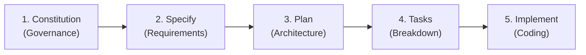

# Git Spec Kit (Spec-Driven Development) Guide

## 1. What is Git Spec Kit?

**Git Spec Kit** is a structured, spec-driven development (SDD) methodology and tooling framework designed for AI-assisted software engineering. 

Instead of jumping straight into coding or prompting an AI to generate code from a single vague request, Spec Kit enforces a **phased pipeline** that separates:
1. **Governance** (global rules, stack decisions, principles)
2. **Requirements** (*what* the feature does from a user/system perspective)
3. **Architecture & Planning** (*how* the technical solution will be built)
4. **Task Breakdown** (dependency-ordered, checkable work units)
5. **Implementation** (actual coding, testing, and convergence)

This discipline ensures:
- **Zero Hallucinated Architecture**: Every line of code conforms to pre-agreed tech stacks and design principles.
- **Predictable Scope**: No creeping complexity or surprise refactors midway through development.
- **Deterministic AI Generation**: Clear verification gates before any source files are created or modified.

---

## 2. The Core 5-Stage Lifecycle

| Phase | Purpose | Primary Artifact | Command / Skill |
| :--- | :--- | :--- | :--- |
| **1. Constitution** | Establishes project-wide tech choices, non-negotiables, coding principles, and workflows. | `.specify/memory/constitution.md` | `/speckit-constitution` |
| **2. Specify** | Defines feature requirements, user stories, edge cases, and acceptance criteria in plain language (no implementation details). | `specs/<feature-id>/spec.md` | `/speckit-specify` |
| **3. Plan** | Translates the spec into technical architecture: database schema, API contracts, dependencies, and file structures. | `specs/<feature-id>/plan.md` | `/speckit-plan` |
| **4. Tasks** | Breaks down the plan into ordered, dependency-aware, testable task items. | `specs/<feature-id>/tasks.md` | `/speckit-tasks` |
| **5. Implement** | Executes the tasks sequentially, writing production code, running tests, and checking off completed items. | Application source code | `/speckit-implement` |

---

## 3. Detailed Phase Breakdown

### Phase 1: Constitution (`/speckit-constitution`)
- **What it does**: Creates or updates `.specify/memory/constitution.md`.
- **When to run**: Once at project initialization, or when making major architectural pivots (e.g. switching from PostgreSQL to MySQL, adding strict validation requirements like Zod).
- **CareerPrepster Status**: Already completed (v1.3.1) defining our full-stack architecture (Next.js, Express, MySQL, Zod) and sequential AI workflow (Template Selection → Wording Assistance → ATS Optimization).

### Phase 2: Specify (`/speckit-specify`)
- **What it does**: Initializes a feature folder inside `specs/<feature-name>/` and writes `spec.md`.
- **Focus**: User outcomes, personas, functional requirements, and edge cases.
- **Rule of Thumb**: Focus strictly on *what* users see and experience, not database table names or framework classes.
- **Supporting Commands**:
  - `/speckit-clarify`: Asks targeted clarifying questions to eliminate ambiguities before planning.
  - `/speckit-checklist`: Generates custom quality checklists for feature scope.

### Phase 3: Plan (`/speckit-plan`)
- **What it does**: Generates `specs/<feature-name>/plan.md`.
- **Focus**: Technical architecture, API route definitions, data models/migrations, dependencies, and integration with the constitution.
- **Supporting Commands**:
  - `/speckit-analyze`: Runs consistency and quality checks between `spec.md`, `plan.md`, and constitution principles before generating tasks.

### Phase 4: Tasks (`/speckit-tasks`)
- **What it does**: Generates `specs/<feature-name>/tasks.md`.
- **Focus**: An actionable, dependency-ordered checklist grouped by phases (e.g., Phase 1: DB & Schemas, Phase 2: Backend APIs, Phase 3: Frontend UI, Phase 4: Integration & Tests).
- **Supporting Commands**:
  - `/speckit-taskstoissues`: Optional export of tasks into GitHub issues.

### Phase 5: Implement (`/speckit-implement`)
- **What it does**: Executes tasks from `tasks.md` one by one.
- **Focus**: Writing code, updating tests, running linters/typecheckers, and marking tasks complete.
- **Supporting Commands**:
  - `/speckit-converge`: Analyzes what was built against `spec.md` and `plan.md` to identify any missing pieces and append them as follow-up tasks.

---

## 4. How to Use Git Spec Kit Step-by-Step

When you are ready to build a new feature or scaffold the repository, follow this sequence:

### Step 1: Initialize the Feature Spec
**Command:** `/speckit-specify Create feature spec for 01-project-scaffolding-and-cv-editor`
- Review `specs/01-project-scaffolding-and-cv-editor/spec.md` to verify all requirements are accurate.

### Step 2: (Optional) Clarify Underspecified Areas
**Command:** `/speckit-clarify`
- Answers any ambiguous questions regarding edge cases, input limits, or error states.

### Step 3: Generate the Technical Plan
**Command:** `/speckit-plan`
- Review `specs/01-project-scaffolding-and-cv-editor/plan.md` to verify schema designs, API contracts, and technology choices.

### Step 4: Generate Actionable Tasks
**Command:** `/speckit-tasks`
- Inspect `specs/01-project-scaffolding-and-cv-editor/tasks.md` to review the execution order.

### Step 5: Start Building
**Command:** `/speckit-implement`
- The AI will execute the tasks, write source code, create components, setup endpoints, and report progress.

### Step 6: Verify Convergence
**Command:** `/speckit-converge`
- Confirms everything specified in the spec and plan was built and tested.

---

## 5. Artifact Directory Structure

Once features are created, your repository structure will look like:

- **`.specify/`**
  - **`memory/constitution.md`**: Global project rules & architecture
  - **`templates/`**: Spec, plan, and task templates
  - **`workflows/`**: Workflow registrations
- **`specs/`**
  - **`01-project-scaffolding/`**: Feature-specific artifacts
    - **`spec.md`**: Feature requirements
    - **`plan.md`**: Architectural design
    - **`tasks.md`**: Ordered checklist of implementation tasks
- **`SPEC_GUIDE.md`**: This guide
- **`src/`** *(or root modules)*: Frontend, Backend, Schemas (built in Phase 5)
