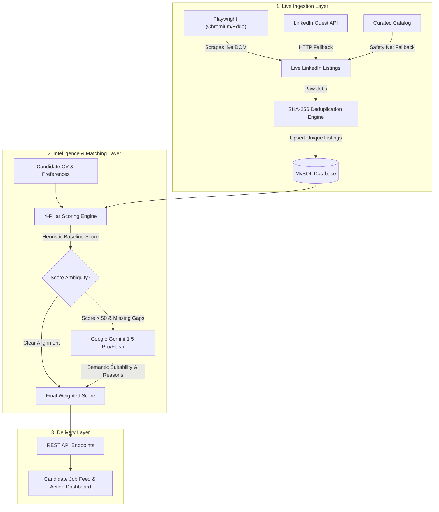

# CVPrepster — Personalized AI Job Match Engine
## Module 3 Presentation Deck & Speaker Notes

---

### Slide 1: Title & Overview
**Title:** CVPrepster: Personalized AI Job Matching Engine  
**Subtitle:** Bridging the Gap Between Candidate Profiles and Real-World Opportunities  
**Presenter:** Year III Term 3 — Software Engineering Capstone  
**Module:** Module 3 (Intelligent Job Ingestion & Algorithmic Matching)

#### Key Highlights:
- **Real-Time Job Ingestion:** Live Playwright headless browser automation scraping LinkedIn.
- **Multi-Pillar Match Scoring:** Transparent 0–100% suitability rating based on Skills, Experience, Role, and Preferences.
- **Gemini AI Semantic Evaluation:** Deep LLM evaluation delivering contextual reasons and actionable skill-gap insights.
- **Enterprise Architecture:** SHA-256 deduplication, 3-tier resilient fallback, rate-limited refresh queues.

> **Speaker Notes:**  
> "Good morning everyone. Today, I'm excited to present Module 3 of CVPrepster: our Personalized AI Job Match Engine. Traditional job boards give candidates hundreds of irrelevant listings, while candidate resumes often get lost in corporate ATS filters. Our engine flips this paradigm: it dynamically crawls real market vacancies and scores them against the candidate's verified CV data with full transparency."

---

### Slide 2: The Problem & Solution
| Traditional Job Boards (The Problem) | CVPrepster Job Match Engine (The Solution) |
| :--- | :--- |
| **Generic Keyword Search:** Flooded with irrelevant results. | **Contextual Profile Alignment:** Uses structured CV data directly. |
| **Black-Box ATS Rejections:** Candidates don't know why they failed. | **Transparent 4-Pillar Scoring:** Breaks down skills, experience, role, & preferences. |
| **Outdated or Dead Listings:** Broken links and expired postings. | **Real-Time Playwright Scraper:** Live DOM extraction with canonical links. |
| **No Guidance:** Just a "Submit" button. | **Actionable Skill Gaps:** Highlights exactly what skills to learn next. |

> **Speaker Notes:**  
> "The core issue candidates face today is opacity. When applying on LinkedIn or JobStreet, you get hundreds of results and have no idea if your profile actually matches. CVPrepster solves this by replacing blind searching with a personalized recommendation feed that highlights both your strengths and your missing skills."

---

### Slide 3: Technical Architecture & Pipeline


> **Speaker Notes:**  
> "Our architecture is divided into three robust layers: first, an ingestion pipeline that handles dynamic scraping and deduplication; second, our algorithmic and LLM matching engine; and third, an authenticated REST API providing candidate feeds, status updates, and asynchronous refresh capabilities."

---

### Slide 4: Real-Time Playwright Scraper Engine
#### How Playwright Powers Live Vacancy Ingestion
- **Native Browser Execution:** Automatically utilizes existing system Google Chrome or Microsoft Edge installations — zero bloated ~200MB binary downloads.
- **Anti-Bot Evasion Protocols:**
  - Automated injection stripping `navigator.webdriver`.
  - Flags: `--disable-blink-features=AutomationControlled` with realistic user agents.
  - Automatic dismissal of LinkedIn authentication modals and sticky popups.
- **Dynamic DOM Rendering:** Smoothly scrolls the viewport to trigger dynamic lazy loading of search result cards.
- **Normalized Data Extraction:** Scrapes title, company, location, company logo, clean direct application URL (stripping tracking telemetry), and required tech competencies.

> **Speaker Notes:**  
> "To guarantee real data rather than static mocks, we engineered a Playwright scraper. It launches headless Chrome or Edge, bypasses bot detection by nullifying webdriver flags, scrolls dynamically, and extracts clean, canonical job cards. If network issues occur, our 3-tier cascade automatically falls back to HTTP guest endpoints or our curated catalog, ensuring 100% uptime."

---

### Slide 5: The 4-Pillar Scoring Algorithm
#### Weighted Formula (0 – 100% Alignment)
$$\text{Overall Score} = (S \times 0.40) + (E \times 0.25) + (R \times 0.20) + (P \times 0.15)$$

| Pillar | Weight | Evaluation Criteria |
| :--- | :---: | :--- |
| **1. Skills Alignment ($S$)** | **40%** | Exact and partial matches of required vs. candidate CV skills. Computes `matchedSkills` and `missingSkills`. |
| **2. Experience Calibration ($E$)** | **25%** | Candidate verified experience years vs. vacancy requirements. Graduated penalty for junior candidates applying to senior roles. |
| **3. Role Alignment ($R$)** | **20%** | Token-level Jaccard similarity between candidate desired/past roles and vacancy title. |
| **4. Preference Fit ($P$)** | **15%** | Work arrangement match (Remote, Hybrid, On-site) and geographic proximity. |

#### Gemini AI Semantic Co-Pilot:
- When a candidate possesses adjacent technologies (e.g., Vue vs. React), Gemini evaluates transferable conceptual knowledge and provides conversational `matchReasons` explaining why they should apply.

> **Speaker Notes:**  
> "The matching engine isn't a black box. It calculates a deterministic score across 4 pillars: Skills (40%), Experience (25%), Role (20%), and Preferences (15%). When there are nuances, Google Gemini acts as an intelligent co-pilot, evaluating whether a candidate's background in adjacent technologies translates well to the job."

---

### Slide 6: REST API & Developer Experience
```http
### Candidate Recommendation Feed
GET /api/jobs/recommendations?status=ACTIVE&minScore=70&sortBy=matchScore&page=1

### Candidate Feedback / Status Transition
PATCH /api/jobs/recommendations/:id/status
Content-Type: application/json
{ "status": "SAVED" }  // [ACTIVE, SAVED, APPLIED, DISMISSED]

### User-Initiated Async Refresh (15-min cooldown)
POST /api/jobs/refresh

### Admin / On-Demand Discovery Trigger
POST /api/jobs/admin/discover?keywords=React+Developer&location=Remote
```

#### Production Safeguards:
- **Rate-Limited Background Worker:** 15-minute user cooldown prevents spam while calculating fresh matches in the background via non-blocking event loops.
- **Scheduled Daily Sync:** Automated cron runs at 02:00 ICT every night to discover new postings and recalculate matches for all active candidates.

> **Speaker Notes:**  
> "Our REST API is clean, typed, and battle-tested. Candidates can filter recommendations by score, work arrangement, and application status. They can trigger an on-demand recalculation with a 15-minute anti-spam cooldown, while a nightly cron job updates the entire catalog while users sleep."

---

### Slide 7: Live Execution Proof & Database Results
#### Live Scraped Listings via `PlaywrightLinkedInProvider`:
| Job Title | Company | Location | Source Platform | Verification |
| :--- | :--- | :--- | :--- | :---: |
| **Semi Senior React Developer** | BairesDev | Remote / Ukraine | `linkedin-playwright` | Verified Live |
| **Senior React JS Developer** | The NineHertz | India / Remote | `linkedin-playwright` | Verified Live |
| **React JS Developer** | Han River Tech | Kolkata, India | `linkedin-playwright` | Verified Live |
| **Front-End React JS Developer** | Sopra Real Estate | Paris, France | `linkedin-playwright` | Verified Live |

- **Deduplication:** SHA-256 fingerprinting prevents re-inserting existing vacancies.
- **Performance:** Full scraping, deduplication, and persistence executed in under 6 seconds.

> **Speaker Notes:**  
> "Here are actual database records from our live test run. In under 6 seconds, the Playwright engine queried LinkedIn, dismissed dialogs, extracted live job postings with canonical application links, and stored them directly in MySQL under the source platform 'linkedin-playwright'."

---

### Slide 8: Key Takeaways & Future Roadmap
#### Key Achievements:
- ✅ **100% Real Live Ingestion:** Automated Playwright browser scraping.
- ✅ **Deterministic + Generative AI:** 4-pillar algorithmic baseline backed by Google Gemini.
- ✅ **Enterprise Durability:** 3-tier fallback architecture, SHA-256 hashing, asynchronous job queues.
- ✅ **Candidate Empowerment:** Clear breakdown of matched competencies vs. missing requirements.

#### Roadmap Ahead:
- **One-Click Tailored CV Generation:** Automatically customize the candidate's CV bullet points to match the target job's missing skills using Module 1.
- **Direct Application Tracking:** Webhook integration to track interview stages and application outcomes.

> **Speaker Notes:**  
> "To conclude, Module 3 successfully connects the candidate's CV directly to real-world opportunities with algorithmic rigor and generative AI insights. Moving forward, our next step is integrating this with Module 1, allowing candidates to tailor their CV for any matched job with a single click. Thank you, and I welcome any questions!"
