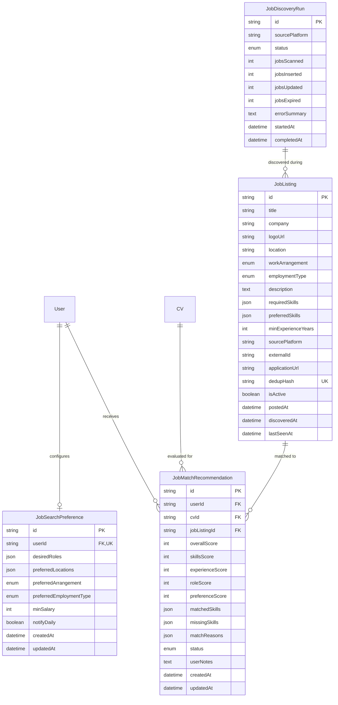
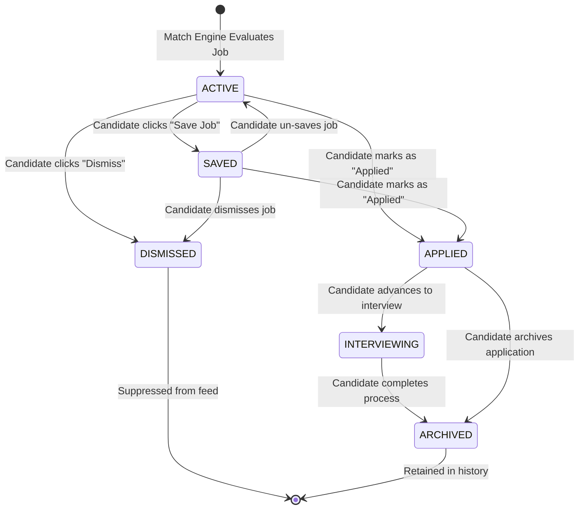

# Data Model: Personalized Job Match

**Feature**: Personalized Job Match  
**Date**: 2026-09-30  
**Status**: Completed (Phase 1)  

This document outlines the relational database schema, Prisma models, enums, validation constraints, and lifecycle state machines supporting the Personalized Job Match feature.

---

## 1. Entity-Relationship Diagram



---

## 2. Prisma Schema Definitions

```prisma
// ==========================================
// 9. JOB MATCHING & DISCOVERY EXTENSION
// ==========================================

enum WorkArrangement {
  REMOTE
  HYBRID
  ON_SITE
}

enum JobEmploymentType {
  FULL_TIME
  PART_TIME
  INTERNSHIP
  CONTRACT
}

enum RecommendationStatus {
  ACTIVE
  SAVED
  DISMISSED
  APPLIED
  INTERVIEWING
  ARCHIVED
}

enum DiscoveryRunStatus {
  RUNNING
  SUCCEEDED
  FAILED
}

model JobListing {
  id                 String             @id @default(uuid())
  title              String             @db.VarChar(150)
  company            String             @db.VarChar(100)
  logoUrl            String?            @db.VarChar(500)
  location           String             @db.VarChar(100)
  workArrangement    WorkArrangement    @default(REMOTE)
  employmentType     JobEmploymentType  @default(FULL_TIME)
  description        String             @db.Text
  requiredSkills     Json               // Array of strings: ["React", "TypeScript", "Node.js"]
  preferredSkills    Json?              // Array of strings: ["Docker", "AWS"]
  minExperienceYears Int                @default(0)
  sourcePlatform     String             @db.VarChar(50) // "remoteok", "arbeitnow", "seed", "linkedin"
  externalId         String?            @db.VarChar(100)
  applicationUrl     String             @db.VarChar(500)
  dedupHash          String             @unique @db.VarChar(64) // SHA-256 of normalized(company|title|location)
  isActive           Boolean            @default(true)
  postedAt           DateTime?
  discoveredAt       DateTime           @default(now())
  lastSeenAt         DateTime           @default(now())

  recommendations    JobMatchRecommendation[]

  @@index([isActive])
  @@index([sourcePlatform])
  @@index([location])
  @@index([workArrangement])
  @@index([employmentType])
  @@map("job_listings")
}

model JobMatchRecommendation {
  id               String               @id @default(uuid())
  userId           String
  cvId             String
  jobListingId     String
  overallScore     Int                  // 0 - 100
  skillsScore      Int                  // 0 - 100
  experienceScore  Int                  // 0 - 100
  roleScore        Int                  // 0 - 100
  preferenceScore  Int                  // 0 - 100
  matchedSkills    Json                 // Array of strings: ["React", "TypeScript"]
  missingSkills    Json                 // Array of strings: ["Docker", "GraphQL"]
  matchReasons     Json                 // Structured reasons: { evidenceReasons: [], skillGaps: [], summary: "" }
  status           RecommendationStatus @default(ACTIVE)
  userNotes        String?              @db.Text
  createdAt        DateTime             @default(now())
  updatedAt        DateTime             @updatedAt

  user             User                 @relation(fields: [userId], references: [id], onDelete: Cascade)
  cv               CV                   @relation(fields: [cvId], references: [id], onDelete: Cascade)
  jobListing       JobListing           @relation(fields: [jobListingId], references: [id], onDelete: Cascade)

  @@unique([userId, jobListingId])
  @@index([userId, status])
  @@index([userId, overallScore])
  @@index([cvId])
  @@index([jobListingId])
  @@map("job_match_recommendations")
}

model JobSearchPreference {
  id                      String             @id @default(uuid())
  userId                  String             @unique
  desiredRoles            Json               // Array of strings: ["Frontend Developer", "Full Stack Engineer"]
  preferredLocations      Json               // Array of strings: ["Phnom Penh", "Remote", "Singapore"]
  preferredArrangement    WorkArrangement?
  preferredEmploymentType JobEmploymentType?
  minSalary               Int?
  notifyDaily             Boolean            @default(true)
  createdAt               DateTime           @default(now())
  updatedAt               DateTime           @updatedAt

  user                    User               @relation(fields: [userId], references: [id], onDelete: Cascade)

  @@map("job_search_preferences")
}

model JobDiscoveryRun {
  id             String             @id @default(uuid())
  sourcePlatform String             @db.VarChar(50)
  status         DiscoveryRunStatus @default(RUNNING)
  jobsScanned    Int                @default(0)
  jobsInserted   Int                @default(0)
  jobsUpdated    Int                @default(0)
  jobsExpired    Int                @default(0)
  errorSummary   String?            @db.Text
  startedAt      DateTime           @default(now())
  completedAt    DateTime?

  @@index([startedAt])
  @@index([status])
  @@map("job_discovery_runs")
}
```

---

## 3. Recommendation Lifecycle State Transitions



---

## 4. Deduplication & Constraint Logic

1. **Unique Recommendation Constraint**:
   - `@@unique([userId, jobListingId])`: Guarantees a candidate never has duplicate recommendation records for the exact same job posting. Updates always use upsert semantics.
2. **Canonical Job Ingestion Constraint**:
   - `@@unique([dedupHash])`: Prevents duplicate records across discovery runs and multi-provider aggregations.
3. **Multi-Tenant User Isolation**:
   - Cascade delete from `User` and `CV` ensures zero orphaned records when accounts or resumes are deleted.
